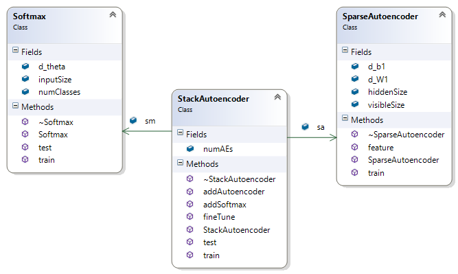

# CUDA Deep Neural Networks

This is an implementation of some Deep Neural Networks (DNN). We closely followed the [ULFDL Tutorial], but using C++/[CUDA] instead of Matlab or Octave.

Each neural network architecture is implemented in a separate class, some of them being composed of others. We already have working versions of the following architectures:

* Sparse autoencoder  (AE)
* Softmax regression  (SM)
* Stacked autoencoders (SAE)

## The Math

We give here, for reference, summarized information for each architecture. Actually, we give mainly the equations that we use in our code, so refer to the [ULFDL Tutorial] for complete explanations. Note that our equations may not look exactly like the ones there, as we will give vectorized versions working with batches of data simultaneously.  But first, some general notation:

| Symbol            | Description                                                 |
|:-----------------:|:------------------------------------------------------------|
|            | Data input size. The dimension of the feature vectors. |
|            | Data train size. How many feature vectors to train. |
|   | Data matrix of dimensions . Each column is a feature vector. |
|   | Label vector of dimension . Element  contains the label of feature vector . | 
|   | Vector of ones and dimension . This is not the identity matrix .|
|   | Matrix of ones and dimension . This is not the identity matrix .|
|  | Weight decay parameter in the cost function. |
|  | Learning rate for gradient descent. |
|   | The sigmoid function.  whatever  may be (real or matrix).|
|   | When applied to a matrix , returns a vector with the maximum element of each column of .|  
|   | Element-wise multiplication. The Hadamard product binary operator. |
|   | Element-wise division. |

All vectors are considered as column matrices. 

You should notice that we try to give vectorized versions of each calculation. Sometimes we just need to sum all the elements of a matrix, but this operation can also be written in matrix form. In fact, given a matrix  with dimensions , we have:

.

In the code this may be implemented different, but this notation is useful.

### Sparse autoencoder
A sparse autoencoder is a neural network with a visible layer , a hidden layer  and an output layer . It's purpose is the output the inputs the most faithful possible. This is not trivial, given that, in general, we have less neurons in the hidden layer than in the input layer.

We define the following:

| Symbol            | Description                                                 |
|:-----------------:|:------------------------------------------------------------|
|             | The dimension of the input vectors (and of the output too).  size. |
|             | The dimension of the hidden layer.  size.  |
|  | Weight matrix of dimensions . The weights between   and   . |
|  | Bias vector of dimension . The bias of  into  . |
|  | Weight matrix of dimensions . The weights between   and   . |
|  | Bias vector of dimension . The bias of  into  . |
|  | Sparsity parameter. Controls the level of sparsity. |
|  | Weight of the sparsity penalty term in the cost function. |

* Initialize the  using a random uniform distribution and the bias  to zeros.

To train the network, in each iteration we do:

* Compute the gradients:

 

* Compute the cost:

* Update the parameters:

### Softmax regression
Softmax regression is a generalization of logistic regression. It's used as the final layer in many neural networks. It receives as input a dataset  with labels , each label  belonging to one of a total of $n$ classes. It's purpose is to, given only the data, predict the class of each of its points.

We define the following:

| Symbol            | Description                                                 |
|:-----------------:|:------------------------------------------------------------|
|             | The dimension of the input vectors. |
|             | The number of classes.  |
|  | Parameters matrix of dimensions .|
|  | Groundtruth matrix of dimensions . Column  contains a binary vector of dimension  corresponding to the binary representation of label  class.|

* Initialize  using a normal distribution.

To train the network, in each iteration we do:

* Compute the gradient:

* Compute the cost:

* Update the parameters:

To make predictions, we note that the matrix  holds the conditional probabilities, so we just need to compute  for the data  we are predicting and take the class with maximum probability:

### Stacked eutoencoders
In this architecture, we stack autoencoders, passing the hidden layer activation of one as the input to the next autoencoder, and so on, until a softmax layer, that outputs the prediction for the data passed as input to the first autoencoder. Each autoencoder is trained using the procedure above, the next one being trained after the previous one finished its training. After that first training is done, we then apply backpropagation to fine-tune the network as a whole.

Here we use the notation from both sparse autoencoders and softmax regression. We just have to be careful about the input from each layer and about which layer we are talking. We will use a superscript to label each matrix/vector with the corresponding sparse autoencoder layer. For example, , means the matrix  from sparse autoencoder layer , where  is the number of autoencoders layers.

To pre-train the network:

* Train the first autoencoder layer with  as input data.
* Train the  autoencoder layer with  as input data.
* Train the softmax layer with   as input data.

To fine-tune the network, in each iteration we do:

* Compute the gradients:

* Compute the cost:

* Update the parameters:

## The Code

To code the equations of the previous session using CUDA, we used the [CUBLAS] library extensively. For some more specific tasks, we implemented CUDA kernels for the job, but sure they can be optimized. All the CUDA kernels, CUBLAS wrappers and some constantes are in header file [helper.cuh](./Visual Studio/DNN/include/helper.cuh).

Besides the helper header, we have for now three other headers, each one implementing one of the above architectures. The following class diagram show the classes we have currently implemented and their relationship:

We also provide a file [mnist.cu](./Visual Studio/MNIST/mnist.cu), with an example application for digit recognition using the [MNIST] dataset. The data is read from text files stored in column-major order. The data are compressed in the file [Visual Studio/MNIST/data/data.7z](./Visual Studio/MNIST/data/data.7z) and need to be extracted before running the program.

## About this documentation

This markdown file [README.md] display equations as images rendered by [CodeCogs]. But the urls of the images are generated from the file [README] by a Python script which can be found in [allanino/markdown-latex]. So, when updating this document, we should always change only the README file and generate the README.md using that Python script.

[ULFDL Tutorial]: http://ufldl.stanford.edu/wiki/index.php/UFLDL_Tutorial
[MNIST]:http://yann.lecun.com/exdb/mnist/
[CUDA]:http://docs.nvidia.com/cuda/
[CUBLAS]:http://docs.nvidia.com/cuda/cublas/
[CodeCogs]:http://www.codecogs.com/latex/eqneditor.php
[README]:./README
[README.md]:./README.md
[allanino/markdown-latex]:https://github.com/allanino/markdown-latex